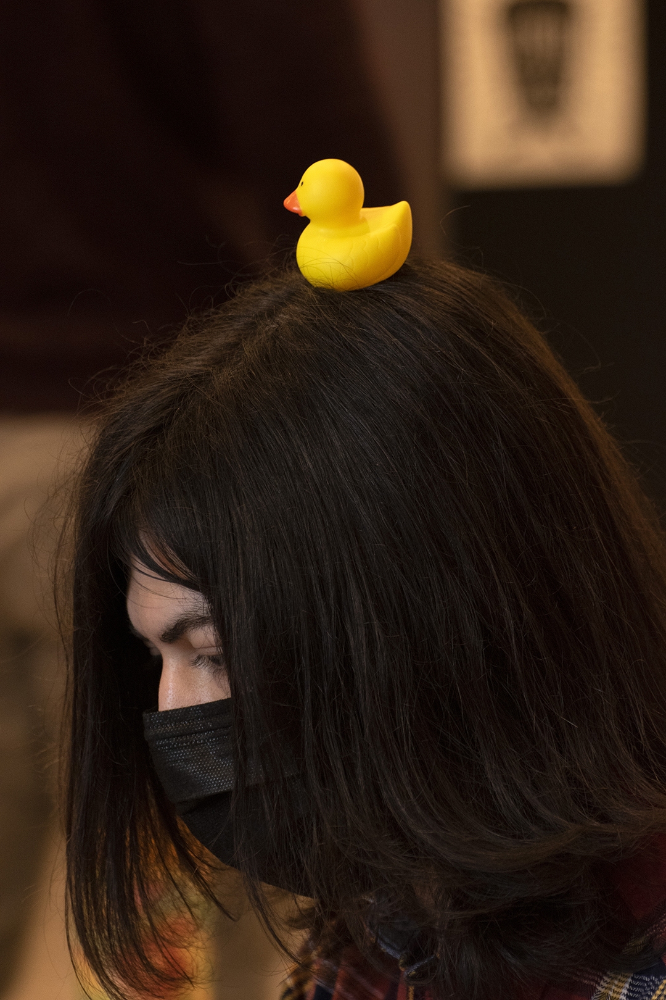

# The architexh teamasf


```c
#include <iomanip>
int main()
{
  std :: cout<<"Mihai e asteptat de Nicu";
  return 0;
}
```
```java
package org.firstinspires.ftc.teamcode;

import com.qualcomm.robotcore.eventloop.opmode.LinearOpMode;
import com.qualcomm.robotcore.hardware.HardwareMap;
import java.util.*;
import com.qualcomm.robotcore.util.Hardware;
import com.qualcomm.robotcore.eventloop.opmode.TeleOp;
import com.qualcomm.robotcore.eventloop.opmode.Disabled;
import com.qualcomm.robotcore.hardware.DcMotor;
import com.qualcomm.robotcore.util.ElapsedTime;
import com.qualcomm.robotcore.util.Range;

@TeleOp(name="PRIMARY", group="Linear Opmode")

public class PrimaryTeleop extends LinearOpMode {

    // Declare OpMode members.
    private ElapsedTime runtime = new ElapsedTime();
    public static final double STRAFE_DAMPENING = 0.7;  //ca sa nu mai rastoarne hans robotu
    public static final double ARMSPEED = 0.6;          //din motive de bun simț
    public static final double DUCKSPEED = 0.3;

    HardwareDrivetrainMecanum1 drivetrain = new HardwareDrivetrainMecanum1();
    HardwareGripper gripper = new HardwareGripper();

    DcMotor ArmMotor = null;
    DcMotor DuckMotor = null;

    @Override
    public void runOpMode() {
        telemetry.addData("Status", "Initialized");
        telemetry.update();

        ArmMotor  = hardwareMap.get(DcMotor.class, "ARM");
        DuckMotor = hardwareMap.get(DcMotor.class, "DUCK");

        ArmMotor.setDirection(DcMotor.Direction.FORWARD);
        DuckMotor.setDirection(DcMotor.Direction.REVERSE);

        waitForStart();
        runtime.reset();

        drivetrain.init(hardwareMap );
        gripper.init(hardwareMap);
        double gripping = 0.0;

        while (opModeIsActive()) {
            //double PowerArm  = -gamepad1.left_stick_y*ARMSPEED;
            double PowerArm = ((gamepad1.dpad_down ? -1.0 : (gamepad1.dpad_up ? 1.0 : 0.0)))*ARMSPEED;
            double PowerDuck =  gamepad1.left_trigger*DUCKSPEED*(gamepad1.left_bumper ? 1.0 : -1.0);
            double drive    =  gamepad1.left_stick_y;
            double strafe   = -gamepad1.left_stick_x*STRAFE_DAMPENING;
            double turn  = -gamepad1.right_stick_x;
            double boost =  gamepad1.right_trigger;

            if(gamepad1.x)
            {
                gripping = 0.75;
            }
            else if (gamepad1.y)
            {
                gripping = 0.4;    
            }

            gripper.grip(gripping);

            ArmMotor.setPower(PowerArm);
            DuckMotor.setPower(PowerDuck);

            Map<String, Double> powers = drivetrain.calcPower(drive, strafe, turn, boost);
            drivetrain.DriveWPower(powers);
            telemetry.addData("Status", "Run Time: " + runtime.toString());
            telemetry.addData("Input", "drive: %.2f", drive);
            telemetry.addData("Output", "drive: %.2f", powers.get("frontRightPower"));
            telemetry.update();
        }
    }
}
```
Primary Teleop
ok

 
 
